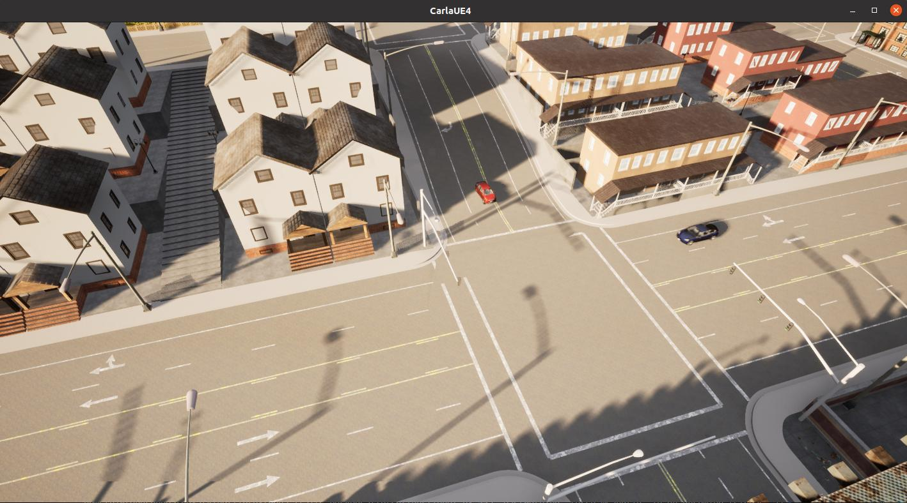

# KING Hybrid Simulation Mode

> **中文版本**: [README.md](README.md)  
> **Original KING Project**: [README_ORIGINAL.md](README_ORIGINAL.md)

<div align="center">
  
  <p><i>Real-time hybrid simulation: CARLA autopilot (ego) + optimized adversarial vehicles</i></p>
</div>

---

📚 **Quick Start**: See [HYBRID_QUICKSTART.md](HYBRID_QUICKSTART.md) for one-minute setup

---

## Overview

This repository extends the original [KING project](https://github.com/autonomousvision/king) with a **Hybrid Simulation Mode** that combines CARLA's realistic physics simulation with ProxySimulator's differentiable optimization.

### Key Features

- **Ego Vehicle**: Controlled by CARLA's autopilot in real physics environment
- **Adversarial Vehicles**: Optimized trajectories via gradient-based methods in ProxySimulator
- **Real-time Synchronization**: Bidirectional state synchronization between CARLA and ProxySimulator
- **Easy Integration**: Swap ego vehicle simulation while keeping adversarial optimization intact

### Why Hybrid Mode?

This implementation serves multiple purposes:

1. **Research Baseline**: For researchers using KING as a baseline who need to replace the ego vehicle simulation
2. **Co-Simulation Example**: A practical reference for implementing CARLA co-simulation with differentiable simulators
3. **Flexible Testing**: Test different ego policies (autopilot, custom controllers) with optimized adversarial scenarios
4. **Educational Value**: Learn how to integrate real physics engines with gradient-based optimization

---

## Installation

The installation process is **identical** to the original KING project. Please follow the setup instructions in the [original KING README](README_ORIGINAL.md).

### Optional Dependencies

For debugging purposes, the hybrid mode implementation uses some additional libraries (e.g., `icecream`). You have two options:

**Option 1: Install debugging libraries**

```bash
# Using pip
pip install icecream

# Or using conda
conda install -c conda-forge icecream
```

**Option 2: Remove debug lines**

If you prefer not to install additional dependencies, you can remove or comment out the debug lines in `proxy_simulator/hybrid_simulator.py`:

```python
# Comment out these lines:
# from icecream import ic
# ic.configureOutput(...)
# ic.disable()

# And remove all ic(...) calls
```

This will not affect the program's functionality.

---

## Usage

### Running Hybrid Mode

#### Step 1: Start CARLA Server

In a separate terminal:

```bash
carla_server/CarlaUE4.sh --world-port=2000 -opengl
```

#### Step 2: Run Hybrid Generation

```bash
bash run_generation_hybrid.sh
```

This script will:
1. Generate scenarios with 1 adversarial vehicle
2. Automatically parse and analyze results
3. Visualize generated scenarios

**Output**: Results will be saved to `experiments/results_hybrid/`

#### Step 3 (Optional): View Simulation in CARLA

To watch the simulation in real-time, open another terminal and run:

```bash
# Set up environment
export CARLA_ROOT=carla_server  # path to your CARLA root
export CARLA_SERVER=${CARLA_ROOT}/CarlaUE4.sh
export PYTHONPATH=$PYTHONPATH:${CARLA_ROOT}/PythonAPI
export PYTHONPATH=$PYTHONPATH:${CARLA_ROOT}/PythonAPI/carla
export PYTHONPATH=$PYTHONPATH:$CARLA_ROOT/PythonAPI/carla/dist/carla-0.9.10-py3.7-linux-x86_64.egg
export PYTHONPATH=$PYTHONPATH:$(pwd -P)/leaderboard
export PYTHONPATH=$PYTHONPATH:$(pwd -P)/scenario_runner

# Run spectator camera that follows ego vehicle
python -c "
import carla
import time

client = carla.Client('localhost', 2000)
client.set_timeout(10.0)
world = client.get_world()
spectator = world.get_spectator()

print('Following ego vehicle... Press Ctrl+C to stop.')

try:
    while True:
        # Find ego vehicle (Tesla Model 3)
        vehicles = world.get_actors().filter('vehicle.tesla*')
        if len(vehicles) > 0:
            ego = vehicles[0]
            transform = ego.get_transform()
            
            # Position camera behind and above ego
            spectator.set_transform(carla.Transform(
                transform.location + carla.Location(z=50),
                carla.Rotation(pitch=-90)
            ))
        
        time.sleep(0.1)
except KeyboardInterrupt:
    print('\nStopped.')
"
```

This will show a bird's-eye view of the simulation. You can also adjust the camera position for different angles.

---

## Configuration

### Key Parameters

You can modify these parameters in `run_generation_hybrid.sh`:

| Parameter | Description | Default |
|-----------|-------------|---------|
| `--use_hybrid_mode` | Enable hybrid simulation | Required |
| `--num_agents` | Number of adversarial vehicles | 1, 2, 4 |
| `--opt_iters` | Optimization iterations | 100-120 |
| `--sim_horizon` | Simulation timesteps | 80 |
| `--initial_speed` | Initial vehicle speed (m/s) | 4.0 |
| `--tm_speed_percentage` | Traffic Manager speed adjustment | 40 |
| `--port` | CARLA server port | 2000 |

---

## Key Differences

### Mode Comparison

| Feature | Standard Mode | Hybrid Mode |
|---------|--------------|-------------|
| **Ego Control** | Neural Network (AIM-BEV/TransFuser) | CARLA Autopilot |
| **Ego Simulation** | ProxySimulator (Kinematic) | CARLA (Physics Engine) |
| **Adversarial Simulation** | ProxySimulator (Differentiable) | ProxySimulator (Differentiable) |
| **Batch Processing** | Multi-batch support | batch_size=1 only |
| **Differentiability** | Fully differentiable | Adversarial only |
| **Realism** | Kinematic approximation | Real physics for ego |
| **Speed** | Fast | Slower (CARLA tick) |

---

## Implementation

### Core Files

- `generate_scenarios_hybrid.py`: Main generation script with `--use_hybrid_mode` flag
- `proxy_simulator/hybrid_simulator.py`: Hybrid simulator implementation
- `run_generation_hybrid.sh`: Convenient execution script

### Key Features

- **State Synchronization**: Real-time bidirectional sync between CARLA and ProxySimulator
- **Gradient Flow**: Maintains differentiability for adversarial vehicle optimization
- **Modular Design**: Easy to swap ego controllers or integrate other simulators

---

## Customization

The hybrid mode supports various customizations:

### Ego Controller

Replace CARLA autopilot with custom controllers. Edit `HybridSimulator.spawn_ego_vehicle()`:

```python
# Comment out autopilot
# self.ego_vehicle_carla.set_autopilot(True)

# Add your custom controller in step()
control = self.custom_controller.run_step(observations)
self.ego_vehicle_carla.apply_control(control)
```

### Traffic Manager Parameters

Adjust driving behavior in `HybridSimulator.spawn_ego_vehicle()`:

```python
# More aggressive driving
self.traffic_manager.vehicle_percentage_speed_difference(ego_vehicle, -50)

# Ignore traffic lights
self.traffic_manager.ignore_lights_percentage(ego_vehicle, 100)

# Keep lane
self.traffic_manager.auto_lane_change(ego_vehicle, False)
```

For implementation details, refer to `proxy_simulator/hybrid_simulator.py`.

---

## Acknowledgements

This hybrid simulation mode example builds upon:

- [KING](https://github.com/autonomousvision/king) - Original scenario generation framework
- [CARLA](https://carla.org/) - Open-source autonomous driving simulator
- The autonomous driving research community

---

## Additional Resources

- 📖 [HYBRID_QUICKSTART.md](HYBRID_QUICKSTART.md) - Quick start guide
- 📖 [README.md](README.md) - Chinese version
- 📄 [KING Paper](https://arxiv.org/pdf/2204.13683.pdf) - Original paper
- 🔧 [CARLA Documentation](https://carla.readthedocs.io/) - CARLA official docs
- 🎓 [Traffic Manager Guide](https://carla.readthedocs.io/en/latest/adv_traffic_manager/) - Advanced TM usage
